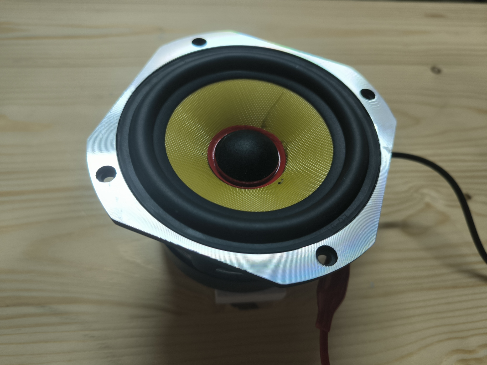
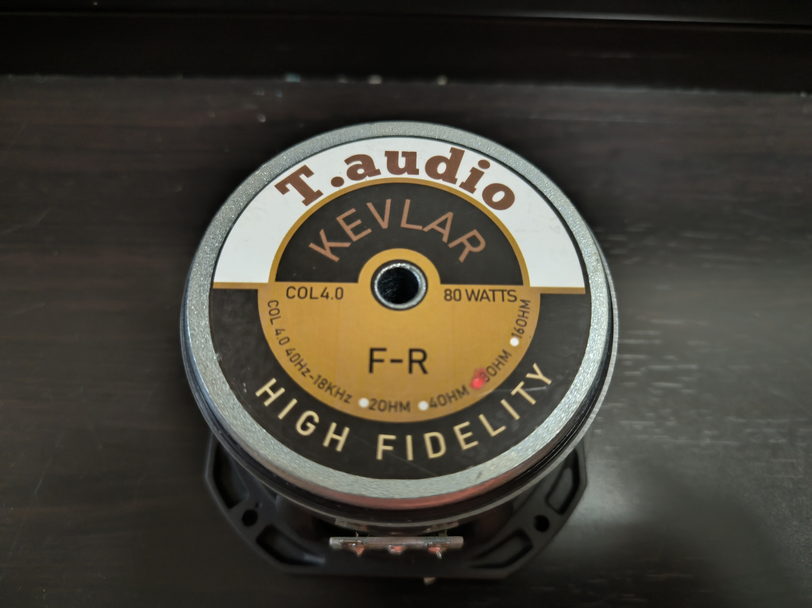

# T.Audio COL4.0-8

## T/S Parameters

```
* This data was exported from the Dayton Audio Test System: DATS
*
* Piston Diameter = 80 mm
* f(s)= 101.9 Hz
* R(e)= 6.035 Ohms
* Z(max)= 62.91 Ohms
* Q(ms)= 8.102
* Q(es)= 0.8597
* Q(ts)= 0.7772
* V(as)= 1.794 liters     (0.06334 cubic feet)
* L(e)= 0.1346 mH
* n(0)= 0.2104 %
* SPL= 85.33 1W/1m
* M(ms)= 4.828 grams
* C(ms)= 0.505 mm/N
* BL= 4.658 
* K(r)= 2.095 
* X(r)= 0.1373 
* K(i)= 1.404 
* X(i)= 0.0662
```




