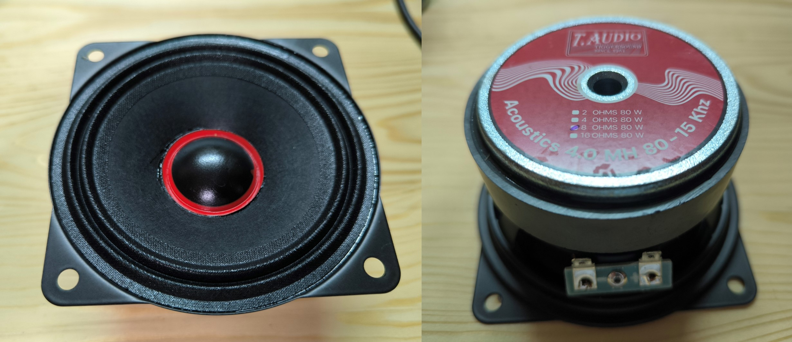
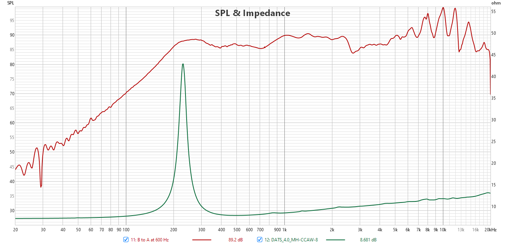
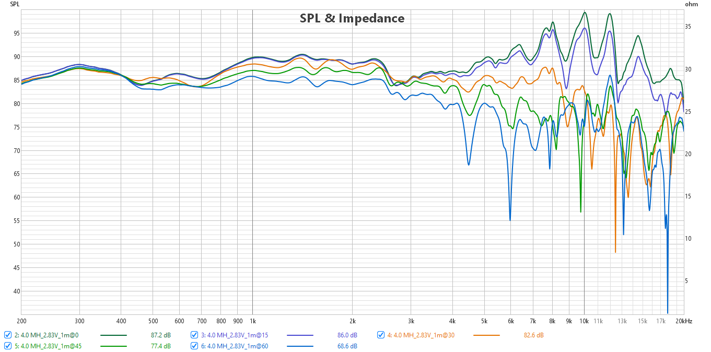
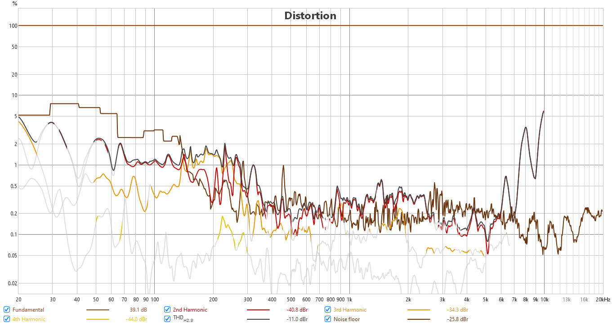
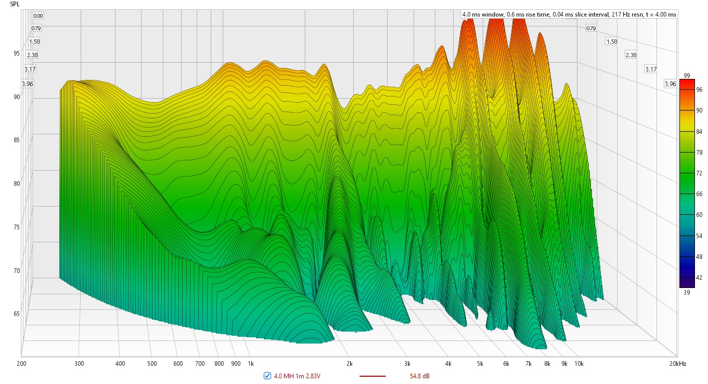

# T.Audio 4.0MH-CCAW - 8 Ohm

## T/S Parameters

```
* This data was exported from the Dayton Audio Test System: DATS
  
* Piston Diameter = 78 mm
* f(s)= 230 Hz
* R(e)= 7.211 Ohms
* Z(max)= 43.62 Ohms
* Q(ms)= 10.6
* Q(es)= 2.099
* Q(ts)= 1.752
* V(as)= 0.3872 liters     (0.01368 cubic feet)
* L(e)= 0 mH
* n(0)= 0.214 %
* SPL= 85.4 1W/1m
* M(ms)= 3.967 grams
* C(ms)= 0.121 mm/N
* BL= 4.438 
* K(r)= 4.563 
* X(r)= 0.08082 
* K(i)= 0.01715 
* X(i)= 0.4801 
```












