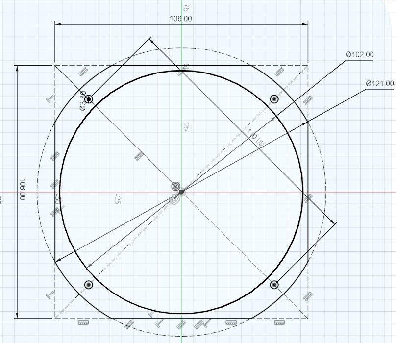

# T.Audio 4MHYKevlar - 4 Ohm

## T/S Parameters

```
* This data was exported from the Dayton Audio Test System: DATS
  
* Piston Diameter = 77 mm
* f(s)= 160.7 Hz
* R(e)= 3.719 Ohms
* Z(max)= 43.4 Ohms
* Q(ms)= 11.76
* Q(es)= 1.102
* Q(ts)= 1.007
* V(as)= 0.5614 liters     (0.01983 cubic feet)
* L(e)= 0 mH
* n(0)= 0.2015 %
* SPL= 85.14 1W/1m
* M(ms)= 5.324 grams
* C(ms)= 0.184 mm/N
* BL= 4.259 
* K(r)= 1.925 
* X(r)= 0.1067 
* K(i)= 0.002702 
* X(i)= 0.6069
```





