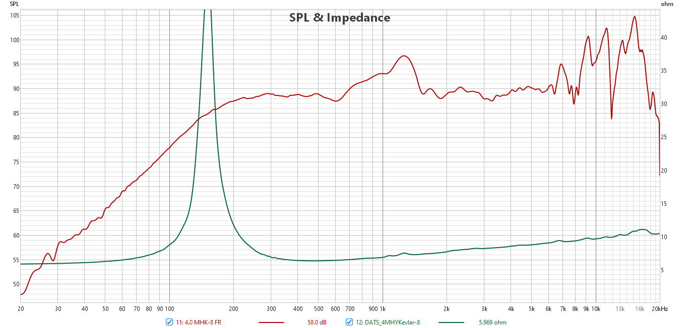

# T.Audio 4MHYKevlar - 8 Ohm

## T/S Parameters

```
* This data was exported from the Dayton Audio Test System: DATS
  
* Piston Diameter = 77 mm
* f(s)= 152 Hz
* R(e)= 5.783 Ohms
* Z(max)= 49.78 Ohms
* Q(ms)= 8.739
* Q(es)= 1.149
* Q(ts)= 1.015
* V(as)= 0.943 liters     (0.0333 cubic feet)
* L(e)= 0 mH
* n(0)= 0.2748 %
* SPL= 86.49 1W/1m
* M(ms)= 3.542 grams
* C(ms)= 0.31 mm/N
* BL= 4.126 
* K(r)= 3.227 
* X(r)= 0.09555 
* K(i)= 0.0006072 
* X(i)= 0.7701 
```





